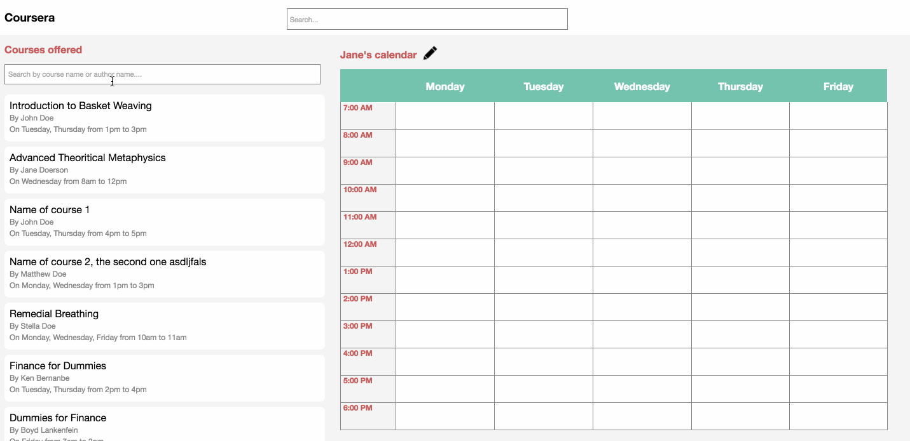

## Info
Project: **Coursera Calendar Challenge**

Author: Ramya Balaraman

LinkedIn: https://www.linkedin.com/in/ramyabalaraman

E-Mail: ramya201@gmail.com

## Framework used

[Angular 2.0](https://angular.io/)

## Steps to Run and Deploy the application

1.	Install the current version of `Node JS`(v6.7.0) which includes `npm`(v3.10.3) on your system in case you don’t have it already. Installation instructions can be found [here](https://nodejs.org/en/download/).
2.	Unzip the project and open it in an editor/IDE that supports Angular2/TypeScript to view the source code.
3.  Run `npm install -g angular-cli` on Terminal.
3.	Run `npm install` on the Terminal _within the project directory_ to install the dependent node modules. In case this fails, please ensure that you have the current version of `npm` (v3.10.3).
4.	Run `npm start` or `ng serve` to start a dev server. In case this fails with a `You have to be be inside an angular-cli project to use...` error, please try `npm install --save angular2` followed by `npm install --save angular-cli` within the project directory and then try again.
5.	Navigate to [http://localhost:4200/](http://localhost:4200/) to view the application.

**Note** - 
## Demo

 
    
## Project Status

User Story|Status|Notes
---|---|---
As a user, I must be able see all the courses in my course catalog. | Done. | Currently hardcoded to reading data from `catalog.json`. Can easily switch to reading from `bigCatalog.json` with a small code change. Change `CoursesService.getCatalogOfCourses()` on Line 28 in `courses.component.ts` to `CoursesService.getBigCatalogOfCourses()`.|
As a user, I must be able to see my calendar. | Done. | |
As a user, I must be able to select and unselect courses. | Done. | |
As a user, I must be able to unselect a course from the calendar itself. | Done. | |
As a user, I must be informed when I try to select courses with a time conflict. | Done. | |
As a user, I must be able to name my calendar. | Done. | Have provided a default name using the user’s first name, which the user can edit.|
As a user, I must be able to edit the name of my calendar. | Done. | |
As an engineer, I need a README that will tell me how to run and deploy your application. | Done. | You are reading it ;). |
As a user, I must be able to search through the course catalog using course name or author name. | Done. | **Extra feature.** There is a search field for the course list which can be used to search. This is a universal search field which can be used to search using both **Course Name** and **Author Name**. Note that the main search bar in the header is _not functional_ currently. |
As a user, I want to view this course calendar on different devices. | Done. | Although the best user experience is currently on desktops, the UI is responsive to smaller screen sizes as well. |

## TODO

The following would need to be implemented for the production version-

1.	Unit test cases.
2.	End-to-end test cases.
3.	Localization/internalization of all strings used in the template. It would make more sense to read the strings from a separate json file in that case instead of embedding it in the HTML. Each supported locale can have a separate json file.
4.	Visual design enhancements.
5.	Improve the UI on mobile devices.
